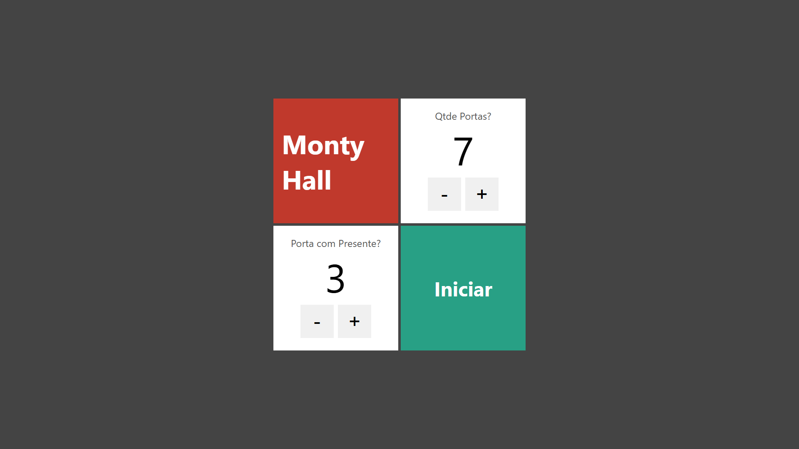
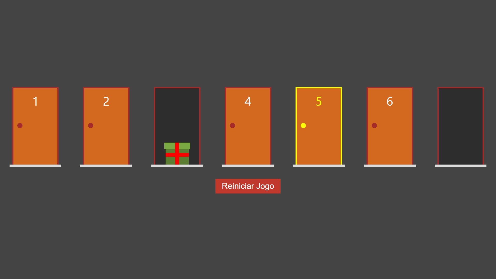

# Porta Premiada (Jogo do Monty Hall)

Projeto desenvolvido com Next.js e React, aplicando conceitos modernos de desenvolvimento web, componentização, tipagem estática com TypeScript e estilização com CSS Modules. 

O objetivo do projeto é a implementação interativa do famoso problema de probabilidade e lógica conhecido como Paradoxo de Monty Hall, onde o usuário configura o cenário de portas e testa suas escolhas em busca do prêmio.

---

## Tecnologias Utilizadas

Este projeto foi construído utilizando as seguintes tecnologias e ferramentas:

* React
* Next.js
* TypeScript
* CSS Modules (para estilização escopada por componente)

---

## Funcionalidades

* ⚙️ **Configuração Dinâmica:** Tela inicial interativa que permite personalizar em tempo real a quantidade total de portas e definir qual delas esconde o prêmio.
* 🛡️ **Validação de Parâmetros:** Sistema de segurança na primeira página que valida as entradas do usuário, garantindo que a porta com o presente nunca seja superior ao número total de portas configuradas.
* 🚪 **Lógica Interativa de Seleção:** Sistema completo de abertura de portas, gerenciamento de estados e controle de fluxo do jogo.
* 🎨 **Estilização Modular:** Interface estilizada utilizando CSS Modules para garantir organização limpa e escopo isolado por componente.
* ✅ **Tipagem Estrita e Build Validado:** Código robusto e tipado com TypeScript, assegurando segurança de tipos e build de produção livre de erros.

---

## Pré-visualização do Projeto

### Tela de Início

### Tela do Jogo

---

## Como Executar o Projeto

Certifique-se de ter o Node.js instalado na sua máquina.

1. Clone este repositório:
git clone https://github.com/Erick-de-Paiva/projeto-porta-premiada.git

2. Entre na pasta do projeto:
cd projeto-porta-premiada

3. Instale as dependências:
npm install

4. Execute o servidor de desenvolvimento:
npm run dev

5. Abra o navegador em http://localhost:3000 para ver o projeto rodando!

---

## Como Gerar o Build de Produção

Se desejar testar a versão otimizada para produção:

npm run build
npm run start
